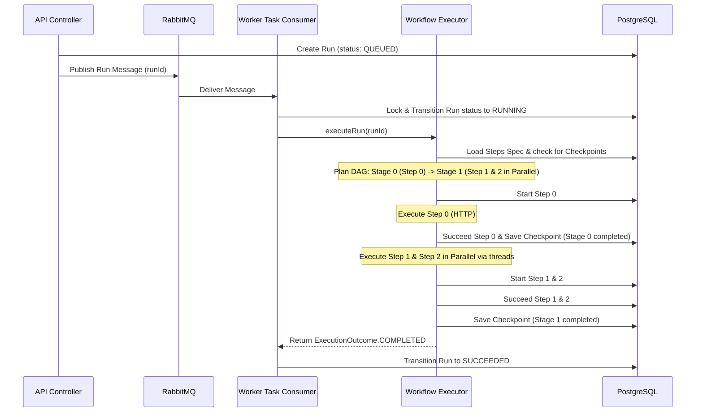
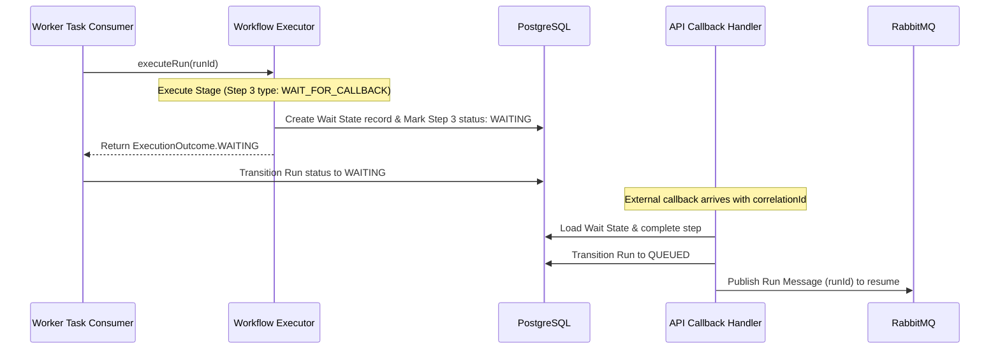
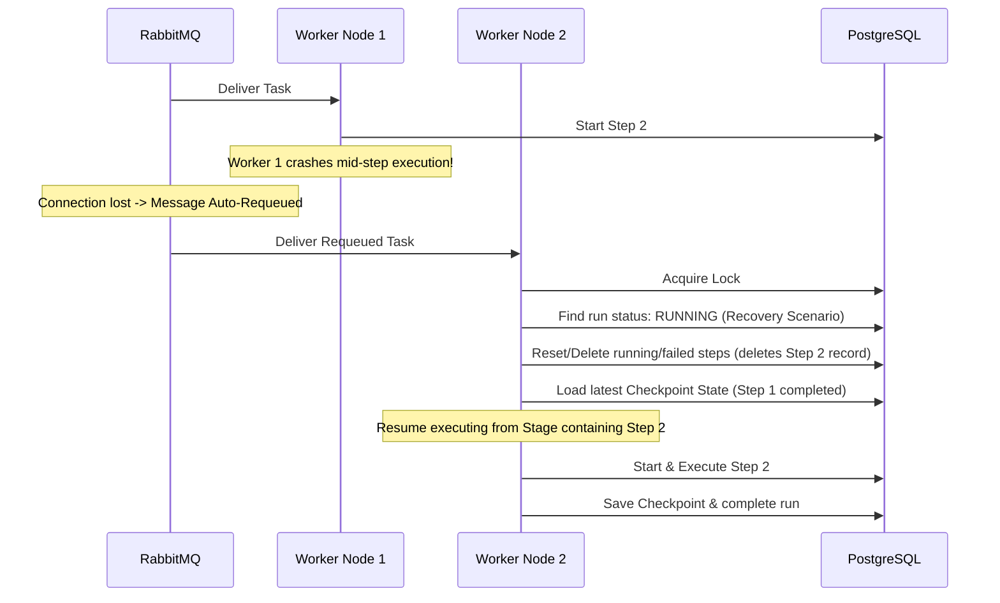

# Architecture Documentation

This document describes the high-level architecture, system components, database schemas, and execution flows of the DAG-based Workflow Engine.

---

## 🏗️ System Overview

The engine is built as a distributed, decoupled system consisting of an **API Gateway Service**, a **Message Queue**, a **Worker Pool**, a **Database**, and an **In-Memory Cache**.

```
[ UI Dashboard (React Flow) ]
            │
            ▼ (HTTP REST)
┌────────────────────────────────┐
│      API Gateway Service       │
└───────────────┬────────────────┘
                │
                ├──────────────────────┐
                ▼ (Publish Jobs)       ▼ (Read / Write)
      [ RabbitMQ Queue ]      [ PostgreSQL DB ] (Runs, Steps, Specs)
                │                      ▲
                ▼ (Consume Tasks)      │ (Load / Save checkpoints)
┌────────────────────────────────┐     │
│       Worker Pool Nodes        │─────┘
└───────────────┬────────────────┘
                │
                ▼ (Locking / De-duplication)
          [ Redis Cache ]
```

### Component Breakdown

1.  **API Gateway**: Exposes REST endpoints to create/update workflows, trigger runs, check run statuses, and query the registered step plugin catalog. It publishes run messages to RabbitMQ.
2.  **RabbitMQ (Message Broker)**: Handles work distribution and guaranteed delivery. If a worker node crashes mid-execution, RabbitMQ automatically requeues the task for recovery.
3.  **Worker Nodes**: Multi-threaded Spring Boot consumers that pull tasks from `workflow.tasks`, manage distributed locks, and execute steps.
4.  **Distributed Lock (Redis)**: Ensures that only one worker can process a specific `runId` at a time, preventing double-execution and database conflicts.
5.  **PostgreSQL (State Store)**: Retains the source of truth for workflow specs, runs history, step-by-step logs/outputs, and intermediate execution checkpoints (`workflow_states`).

---

## 📊 Data Model (Entity Schemas)

```
  ┌───────────────┐          ┌───────────────────┐
  │   workflows   │◄─────────┤ workflow_versions │
  ├───────────────┤ 1      * ├───────────────────┤
  │ id (PK)       │          │ id (PK)           │
  │ name          │          │ workflow_id (FK)  │
  │ active        │          │ spec (JSON)       │
  └───────────────┘          └─────────┬─────────┘
                                       │ 1
                                       ▼ *
  ┌───────────────────┐      ┌───────────────────┐
  │  workflow_states  │◄─────┤   workflow_runs   │
  ├───────────────────┤ 1  1 ├───────────────────┤
  │ run_id (PK/FK)    │      │ id (PK)           │
  │ current_step      │      │ workflow_id (FK)  │
  │ execution_context │      │ status            │
  │ checkpoint_id     │      │ attempt           │
  │ updated_at        │      └─────────┬─────────┘
  └───────────────────┘                │ 1
                                       ▼ *
                             ┌───────────────────┐
                             │ workflow_run_steps│
                             ├───────────────────┤
                             │ id (PK)           │
                             │ run_id (FK)       │
                             │ step_index        │
                             │ status            │
                             │ output (TEXT)     │
                             └───────────────────┘
```

### 1. `workflows`
Represents the top-level workflow catalog item.
*   `id` (UUID, Primary Key)
*   `name` (VARCHAR)
*   `active` (BOOLEAN)
*   `created_at` / `updated_at` (TIMESTAMP)

### 2. `workflow_versions`
Versioning table to support modifying workflow specifications without breaking active runs in-flight.
*   `id` (UUID, Primary Key)
*   `workflow_id` (UUID, Foreign Key $\rightarrow$ `workflows.id`)
*   `spec` (TEXT/JSON) - The DAG JSON specification.

### 3. `workflow_runs`
Tracks the execution lifecycle of a single workflow launch.
*   `id` (UUID, Primary Key)
*   `workflow_id` (UUID, Foreign Key)
*   `status` (VARCHAR: `QUEUED`, `RUNNING`, `WAITING`, `RETRYING`, `SUCCEEDED`, `FAILED`)
*   `attempt` (INT) - Current retry attempt.
*   `max_attempts` (INT)
*   `started_at` / `finished_at` (TIMESTAMP)

### 4. `workflow_run_steps`
Stores execution records, logs, and outputs for individual steps of a run.
*   `id` (UUID, Primary Key)
*   `run_id` (UUID, Foreign Key $\rightarrow$ `workflow_runs.id`)
*   `step_index` (INT)
*   `step_type` (VARCHAR)
*   `status` (VARCHAR: `PENDING`, `RUNNING`, `SUCCEEDED`, `FAILED`, `WAITING`)
*   `logs` / `error_message` (TEXT)
*   `output` (TEXT) - JSON-formatted step return data.

### 5. `workflow_states`
Stores execution checkpoints for active runs.
*   `run_id` (UUID, Primary Key $\rightarrow$ `workflow_runs.id`)
*   `current_step` (INT) - Index of the last completed step.
*   `execution_context` (TEXT/JSON) - Serialized context variables and step outputs map.
*   `checkpoint_id` (UUID) - Unique ID of the current checkpoint.
*   `updated_at` (TIMESTAMP)

---

## 🔄 Sequence Diagrams

### 1. Happy Path (Sequential + Parallel DAG Execution)



### 2. Wait Path (Wait For Callbacks)



### 3. Recovery Path (Worker Crashed Mid-Run)


